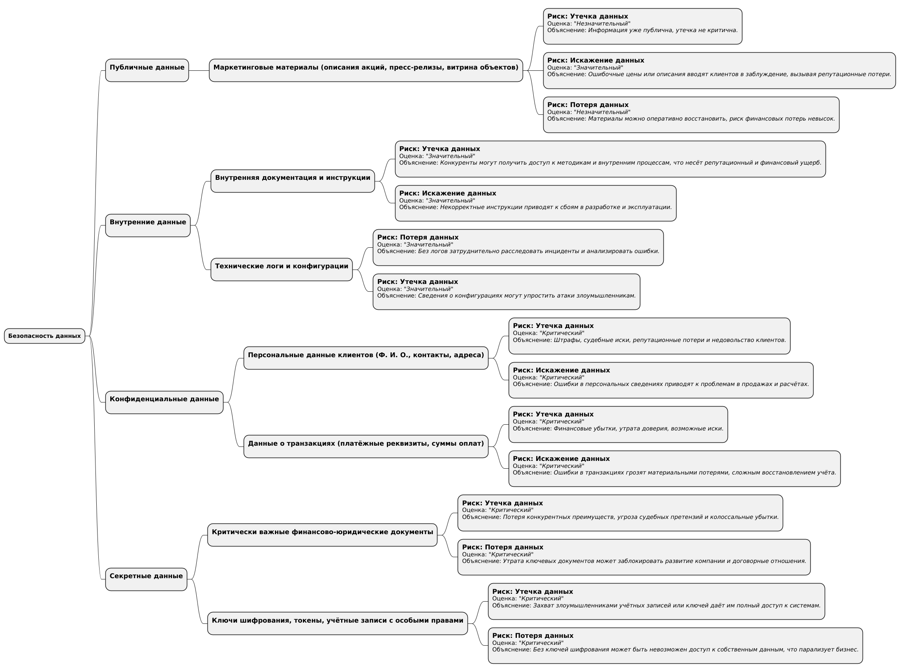

[Назад](../README.md)

---

# Задание 1. Разработка проверочного листа по безопасности данных

## Анализ диаграммы и описания системы

**Суть системы PropDevelopment:**

1. **Группа сервисов для продаж** (онлайн-витрина, онлайн-тур, онлайн-сделка и т. д.) обрабатывает данные клиентов —
   фамилия, имя, отчество, контактные данные, данные для бронирования и покупки недвижимости, а также информацию о
   недвижимости.
2. **Группа сервисов ЖКУ** (витрина сервисов для собственников, tenant-core-app, CRM tenant и т. д.) обрабатывает данные
   собственников (Ф. И. О., контактные данные, данные о жилом объекте, подключённых услугах).
3. **Финансовый домен** (accountant-service, auth-db и т. д.) ведёт учёт финансовых операций — в том числе данные о
   расчётах с покупателями и собственниками, платёжные реквизиты, бухгалтерскую отчётность.
4. **Домен «Дата»** (DWH, BI, отчётность) агрегирует данные из всех доменов для аналитики.
5. **Интеграция с партнёрами** (управляющие компании, поставщики услуг) предполагает передачу части персональных и
   финансовых данных по API.
6. **Active Directory** используется для аутентификации сотрудников (менеджеров, бухгалтеров, аналитиков, разработчиков
   и т. д.).
7. **Клиенты/Собственники** взаимодействуют через интернет, проходя через firewall, и получают доступ к сервисам
   PropDevelopment.

Из этого видно, что компания обрабатывает сразу несколько типов данных: от типовых справочников (например, перечень
услуг, общедоступные характеристики объектов недвижимости) до строго конфиденциальной информации (персональные данные
клиентов, финданные).

---

## Классификация данных

Ниже приведён пример распределения данных по категориям в духе **ISO/IEC 27001 и 27002** (четыре уровня: публичные,
внутренние, конфиденциальные, секретные).  
Разумеется, в реальном проекте каждая категория может быть детализирована под конкретные нужды компании. Но для цели
данного задания достаточно базового разбора.

### 1. Публичные данные

- **Маркетинговые материалы**: описания акций, публичная витрина объектов недвижимости, пресс-релизы и публичные новости
  на сайте.
- **Открытая документация** (публичные отчёты, инструкции на сайте и т. д.) — всё, что разрешено выкладывать в открытый
  доступ.

### 2. Внутренние данные

- **Внутренние рабочие материалы**: методологии, инструкции для сотрудников, часть рабочих документов, не содержащих
  критичных сведений.
- **Технические логи** и конфигурации, не открывающие уязвимостей (например, нейтральные системные события).
- **Статистика и обобщённые данные**, не позволяющие идентифицировать конкретных лиц (например, общий объём продаж без
  детализации по клиентам).

### 3. Конфиденциальные данные

- **Персональные данные клиентов и собственников**: Ф. И. О., контактные данные, история покупок/услуг, информация из
  профилей и личных кабинетов, включая данные о собственности (точный адрес, параметры квартиры).
- **Данные о транзакциях** (платёжные реквизиты, история платёжных операций, суммы).
- **Коммерческая информация**: договоры с поставщиками, управляющими компаниями, детализация сделок, расчётные счета
  компании (если не относятся к «секретным»).
- **Чувствительные сведения в CRM** (например, паспортные данные, если они где-то хранятся до момента передачи
  государственному регистратору).

### 4. Секретные данные

- **Критически важные финансовые/юридические документы**: бухгалтерская отчётность высшего уровня, документы, содержащие
  стратегические планы компании, детальные инвестконтракты.
- **Данные, регулируемые особенно жёсткими законами** (например, персональные данные повышенной чувствительности, если
  компания обрабатывает информацию об очень дорогостоящей собственности, взаиморасчёты на большие суммы, кредитные
  договоры, ипотечные данные и т. п.).
- **Узко ограниченные ключи шифрования**, токены доступа к критичным системам, административные учётные записи Active
  Directory с максимальными привилегиями и т. д.

---

## Определение рисков для каждой категории

Для каждой категории данных рассмотрим базовые риски (утечка, потеря, искажение, некачественные данные, обесценивание) и
почему это важно для данной категории.

### Публичные данные

1. **Утечка данных**
    - **Почему актуально?** Формально публичные данные и так доступны всем, однако некорректная публикация (или
      несвоевременная) может навредить репутации или запутать клиентов.
    - **Риск**: *Незначительный*.
2. **Потеря данных**
    - **Почему актуально?** Потеря публичных данных (например, маркетинговых материалов) скорее несёт репутационный
      урон, но не критичный.
    - **Риск**: *Незначительный*.
3. **Искажение данных**
    - **Почему актуально?** Если искажаются (например, цены, условия акций), это может ввести клиентов в заблуждение.
      Репутационный ущерб возможен, но не столь катастрофичен, как утечка персональных данных.
    - **Риск**: *Значительный* (зависит от масштаба).
4. **Некачественные данные**
    - **Почему актуально?** Публичная информация (ошибки в объявлениях, устаревшие предложения) может смутить клиента,
      снизить доверие.
    - **Риск**: *Незначительный/Значительный* (зависит от частоты и серьёзности).
5. **Обесценивание данных**
    - **Почему актуально?** Публичная информация со временем может морально устареть (например, старые акции). Но
      серьёзных потерь бизнесу это обычно не несёт.
    - **Риск**: *Незначительный*.

### Внутренние данные

1. **Утечка**
    - **Почему актуально?** Содержит корпоративные наработки и внутренние инструкции; при утечке может случиться
      репутационный урон, конкурентные потери.
    - **Риск**: *Значительный*.
2. **Потеря**
    - **Почему актуально?** Утрата внутренних методик/логов может затруднить работу команд, но не остановит бизнес.
    - **Риск**: *Значительный*.
3. **Искажение**
    - **Почему актуально?** Может привести к неправильным настройкам систем, сбоям в процессах.
    - **Риск**: *Значительный*.
4. **Некачественные данные**
    - **Почему актуально?** Внутренняя документация неактуальна, сотрудники дезинформированы, возникают ошибки в
      процессе разработки/эксплуатации.
    - **Риск**: *Значительный*.
5. **Обесценивание**
    - **Почему актуально?** Часть внутренних данных со временем теряет ценность (устаревшие инструкции), но глобально
      угроза для бизнеса обычно невелика.
    - **Риск**: *Незначительный*.

### Конфиденциальные данные

1. **Утечка**
    - **Почему актуально?** Персональные данные клиентов и финансовая информация. Утечка может привести к штрафам,
      судебным искам, серьёзному репутационному ущербу.
    - **Риск**: *Критический*.
2. **Потеря**
    - **Почему актуально?** Потеря финансовых/клиентских данных грозит невозможностью полноценно вести продажи и
      расчёты. Большие финансовые и репутационные риски.
    - **Риск**: *Критический* (особенно для финансовых и персональных данных).
3. **Искажение**
    - **Почему актуально?** Неправильные данные в CRM, неверные расчёты в финансах — существенные репутационные,
      финансовые потери, сложность исправления.
    - **Риск**: *Критический*.
4. **Некачественные данные**
    - **Почему актуально?** Если персональные данные частично неверны (другой номер телефона, другая квартира), растёт
      риск ошибочного выставления счетов, недовольство клиентов.
    - **Риск**: *Значительный* (иногда переходит в критический, если массово).
5. **Обесценивание**
    - **Почему актуально?** Конфиденциальные данные могут «устаревать», если, к примеру, клиент сменил контактные
      данные, но риск не столько обесценивания, сколько неактуальности.
    - **Риск**: *Незначительный/Значительный* (зависит от контекста, но не столь критичен, как утечка/потеря).

### Секретные данные

1. **Утечка**
    - **Почему актуально?** Раскрытие стратегических планов, токенов и ключей шифрования, административных доступов,
      сверхчувствительной финансовой/договорной информации. Может обернуться катастрофическими убытками, судебными
      исками, колоссальной потерей репутации.
    - **Риск**: *Критический*.
2. **Потеря**
    - **Почему актуально?** Утрата ключей шифрования, сложнейших внутренних документов, может парализовать
      бизнес-процессы на время. Восстановление крайне затруднительно.
    - **Риск**: *Критический*.
3. **Искажение**
    - **Почему актуально?** Изменение ключей, финансовых стратегий, важных договорённостей может ввести в заблуждение
      топ-менеджмент, нанести масштабный финансовый урон.
    - **Риск**: *Критический*.
4. **Некачественные данные**
    - **Почему актуально?** Если данные «секретного» уровня неточно ведутся, при принятии управленческих решений
      возможны тяжёлые ошибки.
    - **Риск**: *Значительный* (иногда критический, если решение напрямую зависит от этих данных).
5. **Обесценивание**
    - **Почему актуально?** Со временем часть «секретных» материалов может терять актуальность. Но в целом риск невелик
      по сравнению с утечкой/потерей, так как даже устаревшая секретная информация может частично представлять ценность
      конкурентам.
    - **Риск**: *Значительный* (т. к. потенциально может повлиять на стратегические решения, если данные устарели, а их
      продолжают использовать).

---

## Визуализация результатов анализа в виде mindmap

---

[Назад](../README.md)