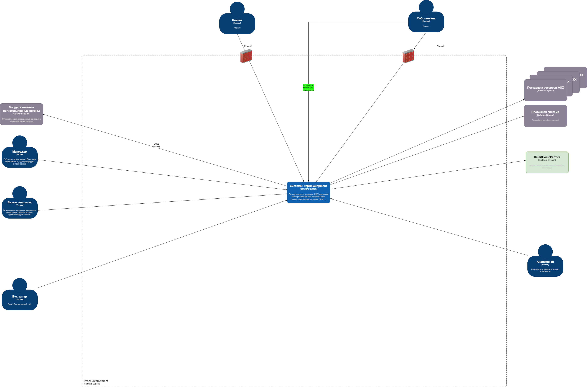
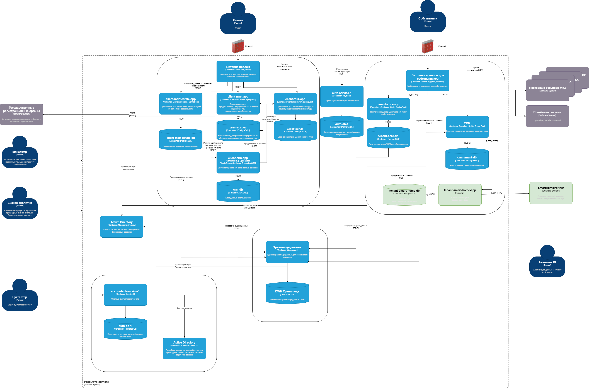

[Назад](../README.md)

---

##  Диаграмма Контекста С4

##  Диаграмма Контейнеров С4

---

## 1. Требования к безопасности

1. **Шифрование каналов связи**
    - Все сетевые соединения между PropDevelopment и внешней платформой должны быть защищены с помощью TLS (HTTPS).

2. **Защита персональных данных и биометрии**
    - Не передавать и не хранить больше персональных данных, чем это нужно для предоставления сервиса (принцип
      минимизации данных).
    - Организовать процесс безопасного хранения и обработки биометрических данных и номеров автомобилей

3. **Безопасно хранить и передавать токены**
    - Предусмотреть защищённые методы хранения токенов (например, в зашифрованном хранилище) и их безопасную передачу по
      защищённым каналам (TLS). Не использовать токены доступа в URL-запросах, так как они могут быть перехвачены.

4. **Аудит действий и журналирование**
    - Все критичные операции (изменение настроек доступов, открытие дверей/шлагбаумов) должны логироваться. Журналы (
      audit logs) должны содержать информацию об инициаторе (ID пользователя, роль, время).
    - Обеспечить централизованное хранение логов и их защиту от несанкционированного доступа.

5. **Контроль доступа и ролевая модель**
    - Необходим чёткий регламент, кто и как может вызывать интеграционные API.
    - Разрешения (access rights) на уровне пользователя и/или сервиса должны проверяться при каждом обращении.

---

## 2. Протоколы аутентификации и авторизации

1. **OAuth 2.0 / OpenID Connect**
    - Для взаимодействия между мобильным приложением собственника и сервисами PropDevelopment может применяться
      токенизация (JWT).
    - Сами сервисы PropDevelopment (`tenant-smart-home-app`) при вызове API внешней платформы тоже могут
      использовать сервисные учётные данные (OAuth 2.0).

2. **Управление ключами и сертификатами**
    - Все ключи, сертификаты и OAuth-секреты должны храниться централизованно и управляться (например, с помощью Vault
      или HSM).
    - Должны быть регламенты ротации ключей и отзыва скомпрометированных сертификатов.

---

## 3. Организация взаимодействия между системами

1. **Логическая схема интеграции**
    - Рекомендуется вынести интеграцию с внешним «умным» сервисом в отдельный микросервис (например,
      `tenant-smart-home-app`), чтобы:
        - Иметь чёткий контроль за данными, которые уходят/приходят от партнёра.
        - Реализовать дополнительные проверки и логику безопасности.
    - Мобильное приложение собственника обращается к `tenant-smart-home-app` внутри PropDevelopment, а тот уже
      взаимодействует с «умным» сервисом партнёра.

2. **Согласованные форматы данных и протоколы**
    - Использовать стандартные подходы REST/HTTP.
    - Согласовать форматы сериализации (JSON и т. д.), а также кодировку символов (UTF-8).
    - Определить чёткий контракт API (Swagger/OpenAPI), где описано, какие данные передаются (особенно если есть
      персональная или биометрическая информация).

3. **Учет законодательных требований**
    - В контрактах API должны быть учтены ограничения по передаче данных (например, нельзя передавать ПДн без согласия).
    - При передаче биометрии и данных о клиентах между партнёром и PropDevelopment должен действовать **договор** о
      соблюдении норм локального законодательства (например, 152-ФЗ в РФ) и регламентов GDPR (если применимо).

4. **Мониторинг и SLA**
    - Должны быть метрики для мониторинга доступности и производительности внешних интеграционных сервисов.
    - Установить SLA с партнёром: время ответа, время на устранение инцидентов, доступность сервиса и т. д.

---

[Назад](../README.md)